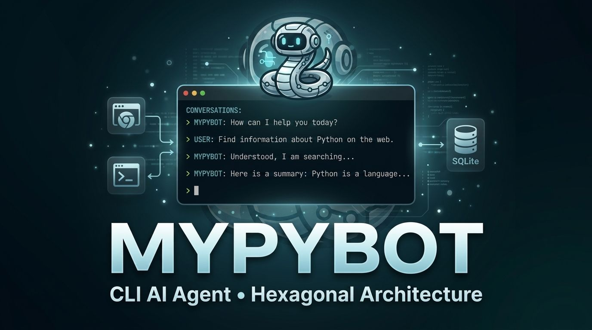

# My_PyBot

An interactive CLI-based artificial intelligence agent.

This project was built to practice hexagonal architecture and design patterns while implementing a practical AI agent with tool-calling and persistent memory.

## Features

- CLI-first conversational agent.
- LLM integration through OpenRouter.
- Tool calling support for terminal commands and web browsing.
- Persistent conversation memory using SQLite.
- Hexagonal architecture with clear inbound/outbound ports.

## Quick Start

### 1) Create and activate a virtual environment

```bash
python3 -m venv venv
source venv/bin/activate
```

### 2) Install dependencies

Install dependencies using requirements.txt

### 3) Configure environment variables

```bash
cp .env.example .env
```

Then set your keys in `.env`.

### 4) Run the bot

```
python3 -m app.adapter.primary.cli
```

Type `exit`, `quit`, or `salir` to close the session.

## Environment Variables

- `OPENROUTER_API_KEY` (required): API key used by the AI provider client.
- `BROWSER_USE_API_KEY` (required for browser tool): key used by the browser automation tool.
- `TAVILY_API_KEY` (optional): reserved for the Tavily integration path.

Reference template:

```env
TAVILY_API_KEY=
BROWSER_USE_API_KEY=
OPENROUTER_API_KEY=
```

## Tools

- Terminal Tool: This tool allows the agent to execute terminal commands, organize files, and more.
- Browser Tool: This tool allows the agent to perform web queries.

## Memory

The agent has a queryable memory system backed by an SQLite database.

Current behavior:

- On startup, the bot attempts to resume the latest existing session.
- If no previous session exists, a new session ID is generated.
- User, assistant, and tool messages are persisted to `memory.db`.
- The latest message history (up to 30 messages) is loaded back into the model context.

## Internal Flow

1. User enters a prompt in CLI.
2. The prompt is added to in-memory history and persisted in SQLite.
3. The app sends the conversation payload (including tool schemas) to OpenRouter.
4. If the model returns a tool call, the requested adapter executes it.
5. Tool output is persisted and injected back into model history.
6. The final assistant response is printed to the terminal and saved.

## Hexagonal Architecture Notes

- Inbound port (`ChatUseCasePort`) defines how external actors interact with the application.
- The `ChatUseCase` orchestrates the business flow and depends only on outbound ports.
- Outbound ports (`AIProviderPort`, `MemoryPort`, `ToolsPort`) define the contracts for external dependencies.
- Adapters implement these contracts (OpenRouter, SQLite, terminal tool, browser tool).
- The domain layer is intentionally minimal in this version; most logic currently lives in the use case layer.

## Model Configuration

Current defaults in code:

- Model: `google/gemini-3.1-flash-lite-preview`
- Temperature: `0.8`

You can tune these values in `ChatUseCase` initialization.

## Security Notes

This project executes raw shell commands through the terminal tool (`shell=True`).

- Use this bot only in trusted/local development environments.
- Do not run it on machines with sensitive data.
- Do not expose API keys or secret files in prompts.
- Consider adding command allowlists/denylists before production usage.

## Troubleshooting

- Provider error or empty response:
  - Verify `OPENROUTER_API_KEY` is present and valid.
  - Check connectivity and OpenRouter quota/limits.
- Browser tool fails:
  - Verify `BROWSER_USE_API_KEY` is set.
  - Ensure dependencies were installed in the active virtual environment.
- Import/module errors:
  - Ensure virtual environment is activated.
  - Reinstall required packages.
- Memory issues:
  - Confirm write permissions in project directory.
  - Ensure `memory.db` is not locked by another process.

## Project Structure

Project layout:

```
MY_PYBOT/
├── app/
│   ├── adapter/
│   │   ├── primary/                # Input adapters (Driving)
│   │   │   └── cli.py              # CLI entry point
│   │   └── secondary/              # Output adapters (Driven)
│   │       ├── database/
│   │       │   └── database_adapter.py
│   │       ├── tools/              # Tool implementations
│   │       │   ├── browser_tool.py
│   │       │   └── terminal_tool.py
│   │       └── openrouter_connection.py
│   ├── domain/                     # Domain layer (currently minimal)
│   │   └── model_payload.py        # Legacy file, currently unused
│   ├── ports/                      # Interfaces and contracts
│       ├── inbound/                # Input/use-case ports
│       │   └── chat_use_case_port.py
│       └── outbound/               # External dependency ports
│           ├── ai_provider_port.py
│           ├── memory_port.py
│           └── tools_port.py
│   └── use_cases/
│       └── chat_use_case.py        # Application orchestration logic
├── .env.example
├── memory.db                       # Auto-created on first run
└── README.md
```
